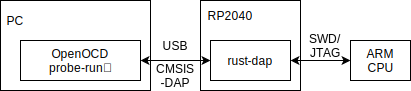

# セキュリティキャンプ2022 LT   RP2040おいしいよ

<!--
_class: lead
_paginate: false
_header: ""
-->

## 自己紹介

* 井田　健太
* Y4 RISC-V CPU自作 講師
* いちおうFPGAの論理設計屋
* 組込みRustたのしい

## RP2040とは

* Raspberry Pi財団が製造している所謂マイコン
  * CPU: Arm Cortex-M0+ dual core @ 133[MHz]
  * RAM: 264[kiB]
  * USB 2.0 FS Host/Device (12Mbps)
* 搭載ボードの **Raspberry Pi Pico** としての方が有名

## RP2040の特徴 (1/2)

* お安い (130円/pcsくらい？)
  * ただし外付けクリスタル、QSPIフラッシュは必要
* **高いオーバークロック耐性**
  * 定格240[MHz]という噂もあり…
* なんか未だに普通に入手できる
  * このご時世では重要！

## RP2040の特徴 (2/2)

* コアが2つあるので通信処理やりやすい
* シンプルで使いやすい公式C/C++ SDK
  * 他社のチップは独自で複雑で環境構築に苦労するものが多い

## RP2040搭載ボードたち

* いろいろなボードが販売されている
* Raspberry Pi公式
  * Raspberry Pi Pico
    * USB microB、リセットボタンがなくてちょっとメンドイ
  * Raspberry Pi Pico H - ピンヘッダ実装済み版
  * Raspberry Pi Pico W - WiFi通信モジュール搭載版

## RP2040搭載ボードたち

* Seeed Studio
  * Seeeduino XIAO RP2040
    * 小さくて便利。USB Type-C、リセットボタンあり
* チップ単体()
  * チップ単体。1507円/10pcs。おやすいね！
  * 500個入りリール 60060円も売ってるよ！さらにお買い得
  * 0.4mm 側面露出のQFN56ピンなので実装はそんなに難しくない…はず

## 特徴的な機能：PIO

* CPUとは別に、IO操作に特化した最大32命令のステートマシン4つ1セットを 2セット分 (つまりステートマシンは8セット) 持っている
* シリアル通信やパラレル通信の実装が簡単に行える
* 専用のアセンブラがSDKに内蔵されている
* これのせいでみんなRP2040はFPGAなのでは？とか言い出す
  * 実際なんかFPGA屋が喜んで使ってる

## RP2040の使われ方

* DVI信号を生成して液晶表示
  * RPi Pico発表と同時くらいに記事が公開された
  * 定格() 240[MHz]駆動でコア1つ使って頑張っている
* デバッグアダプタ作り

## 組込みRustでの利用

* RP2040向けの組込みRust環境はそれなりに整備されている
* 普通にUSBとかは使える
* PIOも使える
* デバッガもサクッと使えて組込み開発なのにかなり楽
* 組込みRustやろうぜ

## 作例：rust-dap (1/3)

* https://github.com/ciniml/rust-dap
* Rustで実装した **CMSIS-DAP**
  * Armが策定している、USBデバッグアダプタの仕様
  * USB経由でSWDやJTAGの信号をやりとりできる

## 作例：rust-dap (2/3)

* ARM公式ファームはWindowsでドライバが自動で読み込まれないのが面倒だったので独自実装
* どうせならRustで実装すればええやん
  * 元はSeeeduino XIAO用だったのをRP2040向けに移植

## 作例：rust-dap (3/3)

* デバッグに不便だったのでボードを作成
* デバッグ対象のRaspberry Pi Pico
* rust-dapを動かすRaspberry Pi Pico
* rust-dapをデバッグするrust-dapを動かすXIAO RP2040

## まとめ

* RP2040超便利！みんな遊ぼう
* 組込みRustやろうぜ