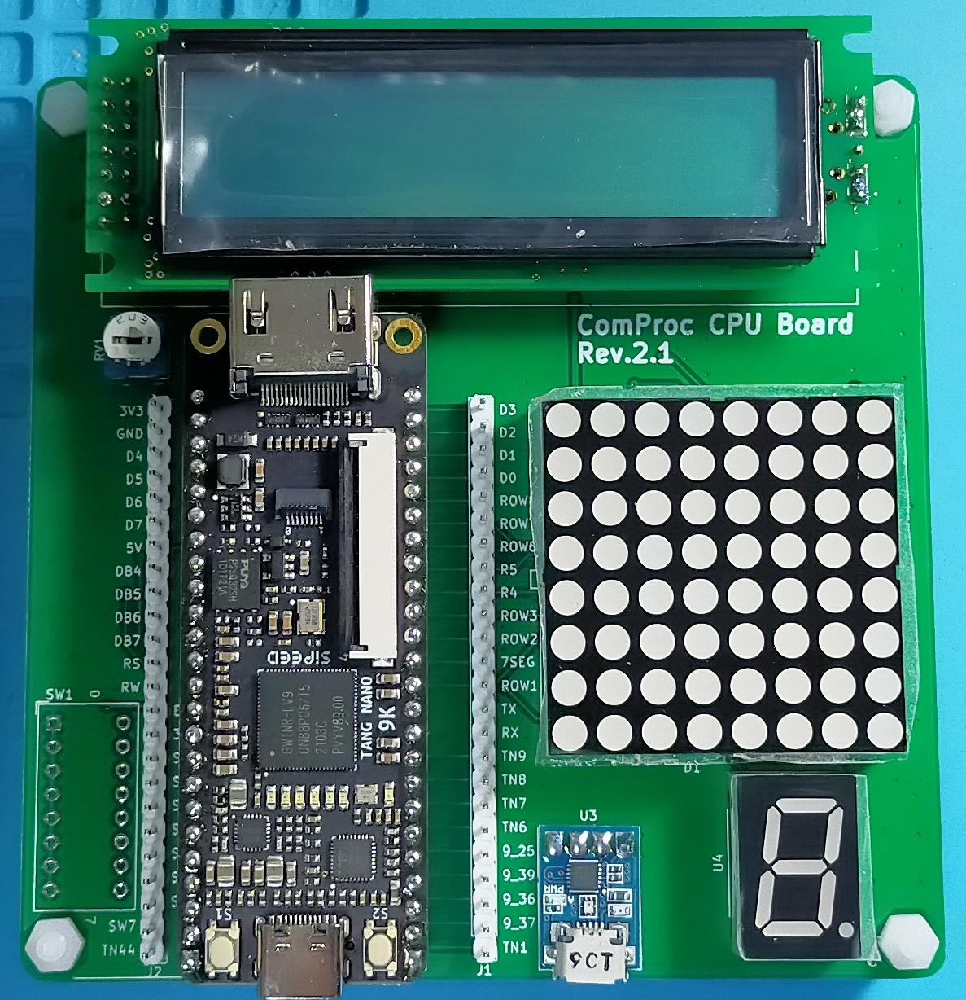

# セキュリティキャンプ2022 Y4   RISC-V CPU自作ゼミ   事前学習

<!--
_class: lead
_paginate: false
_header: ""
-->

## 目次

## 事前学習内容について

* 書籍 「RISC-VとChiselで学ぶ初めてのCPU自作」 第3部まで
  * パイプラインの実装の章
  * 講義中にFPGA上に実装するCPUは第3部までで作成したデザインを使用します
* 機材「ComProc CPU Board Rev.2.1」の動作確認
  * 送付時に書き込み済みのファームウェアの動作確認
  * 簡単なFPGAの論理回路の合成と書き込み

## ComProc CPU Board

* @uchan_nos さんが自作CPU実装用に開発した基板
* Sipeed社のTang Nano 4K/9K 向けの拡張基板

## ComProc CPU Board
* 本講義ではオリジナルの Com Proc CPU Board Rev.2 をTang Nano 9K専用にして簡略化したものを使用
  * 便宜上 Rev 2.1と呼びます
* 以降、講義中に Com Proc CPU Board と言った場合はRev 2.1のことを指します

## ComProc CPU Boardの機能

* FPGAボードとしてTang Nano 9K (Sipeed) を使用
* 搭載FPGA: GOWIN GW1NR-LV9QN88PC6/I5
  * 2022/07 時点で2000円強程度と安価

## ComProc CPU Boardの機能

* 8x8 赤色マトリクスLED
* 7+1セグメントLED
* FPGAからダイナミック点灯により制御可能

## ComProc CPU Boardの機能

* キャラクタLCD
* HD44780互換のLCDコントローラ
* FPGAとは4bitモードで接続

## ComProc CPU Boardの機能

* USB-UART変換器
* FPGAとホスト間でUART通信が可能

## 開発環境(1/2)

* OS
  * Windows: Ubuntu 20.04 on WSL2
  * Linux  : Ubuntu 20.04
  * Mac    : Ubuntu 20.04 on VirtualBox

## 開発環境(2/2)

* GOWIN EDA Education版 1.9.8.03 or later
  * Standard版ライセンスがあるならそれでも可
* openFPGALoader
  * FPGAへの回路情報書き込みツール
* Icarus Verilog (RTLシミュレータ)

## ComProc CPU Boardの動作確認

* Tang Nano 9KのUSB Type-CコネクタをPCや電源に接続
* 下記のリンク先の動画のように動作すること
  * https://twitter.com/i/status/1543679412818034689
* 8x8マトリクスLEDが左上から順に点灯→消灯を繰り返す
* 7+1セグメントLEDの各セグメントが順に点灯→消灯を繰り返す
* キャラクタLCDに A~Z の文字が順に表示される
* Tang Nano 9K上のLEDが順に点灯→消灯を繰り返す

## FPGAのデザイン合成確認

