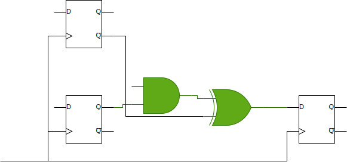
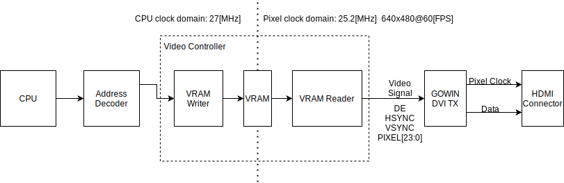

# セキュリティキャンプ2023 Y2 <br/> RISC-V CPU自作ゼミ

<!--
_class: lead
_paginate: false
_header: ""
-->

<style>
img[alt~="center"] {
  display: block;
  margin: 0 auto;
}
</style>

# はじめに

## 講義で取り扱う領域

* RISC-V CPUコアの設計方法については書籍に記載
  * 基本的なRISC-Vコアの実装
  * Chiselの環境構築
  * 簡単なシミュレーションの実行方法
* 書籍では以下の内容は取り扱っていない
  * CPU外部との入出力
  * FPGAへの実装
* 書籍で取り扱っていない部分を補足しつつ、FPGA実装を行い、外部との入出力を行うことが目標

## 書籍で実装するRISC-Vコア

* 第III部までの内容 (パイプライン化)
* RISC-V RV32I のサブセット
  * 一部命令が実装されていない
  * e.g. LB, LH, SB, SHなどのワード単位以外のロード・ストア命令
* 5段パイプライン

# FPGAの紹介

## FPGAとは

* Field Programmable Gate Arrayの略
* ここでは、製造後に論理回路の構成を変更可能なICくらいの認識で良い
* 詳しいことが知りたい場合は [FPGAの原理と構成](https://shop.ohmsha.co.jp/shopdetail/000000004588/) を参照のこと

## FPGAの開発フロー (1/3)



* 機能レベルのアルゴリズム検証
  * PC上やターゲットデバイス上のCPUで動作するソフトウェア実装でアルゴリズムの検証を行う
* RTL実装
  * 実現したい機能のうちハードウェアで担当する部分をVHDLやVerilog HDLといったHDLを用いたRTLモデルとして実装する

## FPGAの開発フロー (2/3)


* ソフトウェア実装
  * 実現したい機能のうちソフトウェアで担当する部分をCPU上のソフトウェアとして実装する
* シミュレーション確認
  * RTL実装やソフトウェア実装を組み合わせて、可能な範囲でシミュレーション確認を行う
  * 所謂RTLシミュレータを用いる

## FPGAの開発フロー (3/3)


* 実機動作確認
  * RTL実装を論理合成・配置配線しFPGAに書き込んだうえで、必要に応じてソフトウェアから制御して動作確認を行う

## 機能レベルのアルゴリズム検証

* 主にC/C++を使ってアルゴリズムを実装し、実現可能かどうかを確認する
* Pythonなどを使って実装確認する場合もあるが、開発フローの後のソフトウェア実装やシミュレーションでも用いる場合があるので、そのあたりの都合に合わせる
* 近年では **高位合成 (High Level Synthesis : HLS)** の普及により、機能レベル実装に手を加えてRTLを生成する場合もある
  * XilinxのVitis HLS, IntelのIntel HLS Compiler等
## RTL実装

* 実現したいシステムのうち、論理回路として実装したい部分を **RTL : Register Transfer Level** と呼ばれる抽象度で実装する
  * RTLはレジスタ、つまりD型フリップフロップ(DFF)とその間の組み合わせ論理回路の接続関係の形で論理回路を記述したもの
  * 要するに、DFFを使った順序回路を記述するということ

## シミュレーション確認

* RTLで記述された論理回路をCPU上でシミュレーションする **RTLシミュレータ** を用いて、RTL実装が正しいかどうかを検証する
* FPGA開発はASICのような手戻り時の莫大なコストはないとはいえ、規模が大きくなると論理合成・配置配線に時間がかかるので、十分に動作確認を行っておくことが重要
* FPGAベンダーが提供しているシミュレータや、OSSのシミュレータを用いる
  * e.g. Icarus Verilog, Verilator等
  
## 実機動作確認

* 対象のFPGA向けに **論理合成 (Logic Synthesis)** と **配置配線 (Place and Route)** を行い、FPGAに書き込むためのビットストリームを生成する
* ビットストリームをFPGAに書き込んで、所望の動作をするか確認する
* 一般的に、ソフトウェアのビルドと比較して、論理合成・配置配線には時間がかかる
  * 今回のCPUコアの場合：1分程度
  * 大規模FPGAを対象としたシステム：数時間
* デバッグもソフトウェアと比べて行いにくいので、シミュレーションでの確認が重要
  * リソースを余分に消費してロジックアナライザを埋め込んで信号を観測するなどが必要

## 論理合成・配置配線

* RTLで記述された論理回路から最終的にFPGAに書き込み可能な **ビットストリーム (bitstream)** を生成するフロー
  * ソフトウェアをビルドして実行可能形式のバイナリを生成するのと同じ

## 論理合成

* RTLで記述された論理回路を解析して順序回路やマクロのグラフに変換する (Elaboration)
* 論理回路の簡略化を行う (Optimisation)
* 対象のFPGAのプリミティブのグラフに変換する (Technology Mapping)


## 配置配線

* デバイス上の個々のプリミティブに対して、配線距離などの制約条件のもと、配置箇所を決定する (Placement)
* 配置したプリミティブ間の配線経路を決定する (Route)
* 制約条件を満たすまでやりなおす
  * 制約条件：クロックの周波数情報から導かれる、順序論理回路の動作周波数を満たすことができる配置配線

## タイミング解析 (1/2)

* 現実の論理回路には、動作可能な最大周波数の上限が存在する
  * 電気信号の伝搬遅延はどうしても避けられない
* 順序論理回路では、あるDFF(レジスタ)の出力から別のDFFの入力までの伝搬遅延が、DFFのクロックの周期より十分短い必要がある
* DFF間の論理回路のうち、もっとも伝搬遅延が長い経路を **クリティカル・パス (Critical Path)** という



## タイミング解析 (2/2)

* どこがクリティカルパスになるかは配置配線結果に依存する
  * FPGAでは一般的に論理素子の伝搬遅延より、配線の伝搬遅延のほうが大きい
* タイミング解析により、配置配線後のDFF間の経路の伝搬遅延が、クロック周期より短いかどうかを確認する
* タイミング解析には、一般的には比較的厳しい条件 (温度が高い、電圧が低い、製造上のばらつきにより遅い等) を用いる
  * 場合によっては条件を変更する


# FPGAで動くようにする

## FPGAで合成チャレンジ！

* 意外とそのまま行けたりするんじゃないの？という話もあるので、まずは合成できるベースまで持っていく

## ChiselからVerilog HDLの生成

* FPGAの論理合成系へ入力できるようにするためChiselからVerilog HDLへの変換が必要
* Chiselではこの処理のことを **エラボレーション (Elaboration)** と呼ぶ

## Chiselのエラボレーション(1/3)

* `runMain` で実行できるように `App` の派生クラスを定義する
* `ChiselStage` の `emitVerilog` に、Verilogに変換したいChiselのモジュールを渡して呼び出す
* 第2引数に変換時のパラメータを含む `Array` を指定する
* [ソースコード](https://github.com/ciniml/seccamp_2022_riscv_cpu/commit/2034593fdcbc47afe6c69645725156650721e34f#diff-82642955d40c62f14b05b84c1f51eaa3adf0551a9c488f93978c2262f2840ce5R13)

<style scoped>
pre {
  font-size: 18px;
}
</style>

```scala
package fpga

import chisel3._
import chisel3.stage.ChiselStage
import cpu.Top

object Elaborate_ComProcCpuBoard extends App {
  (new ChiselStage).emitVerilog(new Top, Array(
    "-o", "riscv.v",
    "--target-dir", "rtl/comproc_cpu_board",
  ))
}
```

## Chiselのエラボレーション(2/3)

* sbtから定義したAppを呼び出す

```shell
$ sbt
sbt:riscv_chisel_book> runMain fpga.Elaborate_ComProcCpuBoard
[info] compiling 6 Scala sources to /home/kenta/repos/seccamp_2022_y4_riscv/fpga_impl/target/scala-2.12/classes ...
[info] running fpga.Elaborate_ComProcCpuBoard 
Elaborating design...
Done elaborating.
```

## Chiselのエラボレーション(3/3)

* `--target-dir` パラメータで指定したディレクトリ (`rtl/comproc_cpu_board`) に変換後のVerilogのモジュールが出力される
* 出力ファイル名は `-o` パラメータで指定したファイル名 (`riscv.v`)

```
rtl
└── comproc_cpu_board
    ├── firrtl_black_box_resource_files.f
    ├── riscv.v
    ├── Top.anno.json
    ├── Top.fir
    └── Top.Memory.mem.v
```

## Chiselから変換したHDLの論理合成

* とりあえずGOWINの合成系で合成してみる
* 合成時にエラー

```
eda/cpu_riscv_chisel_book$ make
(省略)
Running inference ...
ERROR (RP0001) : The number(131072) of DFF in the design exceeds the resource limit(6480) of current device(GW1NR-LV9QN88PC6/I5)
ERROR (IF0003) : Cannot infer "mem" due to multiple write clocks("/home/kenta/repos/seccamp_2022_y4_riscv/fpga_impl/rtl/comproc_cpu_board/riscv.v":1029)
GowinSynthesis finish
```

* DFFの個数が **131072** 個になっていてFPGAに載らない
  * 対象デバイスには **6480** 個しかDFFがない
* コアで使っているDFFは多く見積もっても 32bit幅のものが100個分程度 = DFF 3200個くらい
  * レジスタファイル (32bit * 40) やパイプラインレジスタ
* ではどこでDFFを使っているのか？

## FPGA向けHDLでのメモリの表現

* FPGA向けの合成系では、メモリ (SRAM) を表現する方法が大きく分けて2つある

1. FPGAのメモリ・プリミティブを直接インスタンス化する
2. 合成系のRAM推論規則に従ったHDLを記述する

* ChiselでFPGA向けのデザインを記述する場合は、一般的には **2** の方法を用いる
  * 規則は合成系によって微妙に異なるが大枠は一緒

## そもそもRAMとは

* 指定したアドレスに対してワード単位での読み書きが可能な記憶素子
* 記憶素子の構造などによりいくつかの種類がある
  * e.g. Static RAM (SRAM), Dynamic RAM (DRAM)

## RAMに専用の構造が必要な理由

* 一番単純な構造でも
アドレスから入出力を選択するマルチプレクサが巨大な回路になる
  * 回路規模の増大
  * 遅延の増加による動作周波数低下
* アドレスから行・列をそれぞれ選択するように分割
* SRAMをFPGAの論理素子で構成すると多量の素子を消費する
  * SRAMを1つの大きいブロック(ハードマクロ)として実装して利用する

## SRAMの使い方 (読み出し)

1. `CE (Chip Enable)` 信号をアサートする
2. ホストがアドレス線にアドレスを出力する
3. データ出力線にアドレスに対応するセルのデータが出力される
4. `CE` 信号をデアサートする

## SRAMの使い方 (書き込み)

1. `CE (Chip Enable)` 信号をアサートする
2. ホストがアドレス線にアドレスを出力する
3. ホストがデータ入力線にデータを出力する
4. `WE (Write Enable)` 信号をアサートする
5. `WE` 信号をデアサートする
6. `CE` 信号をデアサートする

## GOWIN合成系におけるRAM推論規則 (1/2)

* 前述のSRAMの使い方に対応する処理を記述すると、対応するレジスタをSRAMのワードアクセスに推論する
* GOWINの合成系 (GowinSynthesis) のユーザーガイド (SUG550) に記載

## GOWIN合成系におけるRAM推論規則 (2/2)

* 8bit x 1024 (1[kiB]) のRAM記述の例

<style scoped>
pre {
  font-size: 20px;
}
</style>

```verilog
logic [9:0] address;      // アドレス
logic [7:0] mem[0:1023];  // メモリ本体
logic ce;                 // Chip Enable
logic we;                 // Write Enable
logic [7:0] data_in;      // データ入力
logic [7:0] data_out;     // データ出力
always_ff @(posedge clock) begin
  if(reset) begin
    data_out <= 0;
  end
  else begin
    if( ce ) begin
      data_out <= mem[addr];
      if( we ) begin
        mem[addr] <= data_in;
      end
    end
  end
end
```

## 推論規則による推論に失敗した場合

* 前述のHDLの記述の通り、そのままメモリのセルがすべてDFFに展開される
  * 1[kiB]のメモリなら、 8192個のDFFとアドレス選択回路になる
* さきほどのエラボレーション結果で意図せぬ個数のDFFがでたのはこのため
  * 16[kiB] = 131072個のDFF
    * `The number(131072) of DFF in the design exceeds the resource limit(6480) of current device(GW1NR-LV9QN88PC6/I5)`
  * エラーメッセージの内容と一致

[ソースコード](https://github.com/ciniml/seccamp_2022_riscv_cpu/commit/2034593fdcbc47afe6c69645725156650721e34f#r80562783)
```scala
// Memory.scala 26行目
val mem = Mem(16384, UInt(8.W))
```
→ なぜ推論されなかったのか？

## Chiselの `Mem` 型

* "A combinational/asynchronous-read, sequential/synchronous-write memory."
  * https://www.chisel-lang.org/api/latest/chisel3/Mem.html
* 非同期読み出し・同期書き込みメモリ
  * c.f. FPGAのSRAMは同期読み出し・同期書き込み
* 等価回路は下記の通り
  * `data_out` がレジスタになっておらず、推論規則と異なる回路

<style scoped>
pre {
  font-size: 14px;
}
</style>

```verilog
logic [9:0] address;      // アドレス
logic [7:0] mem[0:1023];  // メモリ本体
logic ce;                 // Chip Enable
logic we;                 // Write Enable
logic [7:0] data_in;      // データ入力
logic [7:0] data_out;     // データ出力
assign data_out = mem[address]; // 同一サイクル出力
always_ff @(posedge clock) begin
  if(!reset) begin
    if( ce & we ) begin
      mem[addr] <= data_in;
    end
  end
end
```


## Chiselの `SyncReadMem` 型

* "A sequential/synchronous-read, sequential/synchronous-write memory."
  * https://www.chisel-lang.org/api/latest/chisel3/SyncReadMem.html
* 同期読み出し・同期書き込みメモリ
* こっちを使えばいけそう？

## `SyncReadMem` に変更してみる

* 変更

[ソースコード](https://github.com/ciniml/seccamp_2022_riscv_cpu/commit/e1ec4bbaeda81a61d2eb007ea0bfba133e377872#diff-35d538729e9742f94efbfb81f1a91eb4b396247989a4906ed56ad7f0888cd0c3R26)
```scala
val mem = SyncReadMem(16384, UInt(8.W))
```

* 結果

```
ERROR (RP0001) : The number(131072) of DFF in the design exceeds the resource limit(6480) of current device(GW1NR-LV9QN88PC6/I5)
ERROR (IF0003) : Cannot infer "mem" due to multiple write clocks("/home/kenta/repos/seccamp_2022_y4_riscv/fpga_impl/rtl/comproc_cpu_board/riscv.v":1039)
```

* エラーメッセージに変化なし
* そもそも2行目に `Cannot infer "mem" due to multiple write clocks` とある
* どういうことか？

## Schematic Viewerで確認


* Gowin EDAのプロジェクトを作成して、エラボレーション結果のVerilog HDLを追加
* `Tool -> Schematic Viewer` から **Schematic Viewer** で回路を表示
* RAMに対して書き込み4ポート、読み出し8ポート存在する

## FPGAの内蔵SRAMのポート数

* FPGA内蔵のSRAMは、大体のデバイスで最大2つまでのポートを使用可能
  * 所謂Dual Port Memory
* FPGAに実装するには一つのSRAMあたりポート数を2つまでに減らす必要がある



## ポート数が増えている原因

* 32bit読み書きのために8bit幅で4回ずつ読み書きしている
  * 命令読み出し、データ読み書き

<style scoped>
pre {
  font-size: 16px;
}
</style>

[ソースコード](https://github.com/ciniml/seccamp_2022_riscv_cpu/commit/e1ec4bbaeda81a61d2eb007ea0bfba133e377872#diff-35d538729e9742f94efbfb81f1a91eb4b396247989a4906ed56ad7f0888cd0c3L29)

```scala
val mem = SyncReadMem(16384, UInt(8.W))
loadMemoryFromFile(mem, "src/hex/hazard_ex.hex")
io.imem.inst := Cat(
  mem(io.imem.addr + 3.U(WORD_LEN.W)), // Read 0
  mem(io.imem.addr + 2.U(WORD_LEN.W)), // Read 1
  mem(io.imem.addr + 1.U(WORD_LEN.W)), // Read 2
  mem(io.imem.addr)                    // Read 3 
)
io.dmem.rdata := Cat(
  mem(io.dmem.addr + 3.U(WORD_LEN.W)), // Read 4
  mem(io.dmem.addr + 2.U(WORD_LEN.W)), // Read 5
  mem(io.dmem.addr + 1.U(WORD_LEN.W)), // Read 6
  mem(io.dmem.addr)                    // Read 7
)

when(io.dmem.wen){
  mem(io.dmem.addr)                   := io.dmem.wdata( 7,  0) // Write 0
  mem(io.dmem.addr + 1.U(WORD_LEN.W)) := io.dmem.wdata(15,  8) // Write 1
  mem(io.dmem.addr + 2.U(WORD_LEN.W)) := io.dmem.wdata(23, 16) // Write 2
  mem(io.dmem.addr + 3.U(WORD_LEN.W)) := io.dmem.wdata(31, 24) // Write 3
}
```

## ポート数を増やす(1/3)


* ポート数が足りないのであれば、SRAMの割り当て方を変えればよい
  * e.g. 複数SRAMを並べる
* 今回の場合は1度に32bitアクセスしたいので、8bitごとに4つにわけて並べる

## ポート数を増やす(2/3)

* Chiselでは、 `Vec` 型を使った配列型をメモリの要素型とすれば対応可能

[ソースコード](https://github.com/ciniml/seccamp_2022_riscv_cpu/commit/e1ec4bbaeda81a61d2eb007ea0bfba133e377872#diff-35d538729e9742f94efbfb81f1a91eb4b396247989a4906ed56ad7f0888cd0c3R26)
```scala
// 要素型を8bit幅x4つの配列にし、メモリの長さを1/4に変更
val mem = SyncReadMem(16384/4, Vec(4, UInt(8.W))) 
loadMemoryFromFile(mem, "src/hex/hazard_ex.hex")
io.imem.inst := Cat(
  mem.read(io.imem.addr >> 2).reverse,  // アドレスをワード単位に変換。長さ4のVecが返ってくるのでreverseで逆順にしてCatで結合
)
io.dmem.rdata := Cat(
  mem.read(io.dmem.addr >> 2).reverse,
)
when(io.dmem.wen){
  // wdataを8bit単位に切り分けて逆順に並べなおしたものを書き込む
  mem.write(io.dmem.addr >> 2, VecInit((0 to 3).map(i => io.dmem.wdata(8*(i+1)-1, 8*i)).reverse))
}
```

## ポート数を増やす(3/3)


* Schematic Viewerで効果を確認
  * RAMが4つになり、それぞれ読み書き2ポートまでに抑えられている
* 合成して効果を確認
  * 論理合成・配置配線が成功する

## シミュレーション確認(1/5)

* `riscv-tests` のテストを実行
* 全テスト失敗する
* 原因は、 `loadMemoryFromFile` が `Vec[UInt]` 型を要素とする `Mem` に対応していないこと
  * `loadMemoryFromFile` だとエラーにならず分かりずらいが `loadMemoryFromFileInline` だと以下のエラーが出る

```
[info]   Cause: java.lang.RuntimeException: [module Memory] Cannot initialize memory mem of non ground type UInt<8>[4]
```

## シミュレーション確認(2/5)

* 対策として、 `SyncReadMem` の型を `Vec[UInt]` にするのではなく、 `SyncReadMem` を複数用意する
* `loadMemoryFromFile` の入力データもバイト単位で分割しておく
  * 分割後のファイル名を取得するためのlambdaを渡しておく

<style scoped>
pre {
  font-size: 12px;
}
</style>

[ソースコード](https://github.com/ciniml/seccamp_2022_riscv_cpu/commit/14aa890565e0715827d8f9daf794c11be58c20ef#diff-35d538729e9742f94efbfb81f1a91eb4b396247989a4906ed56ad7f0888cd0c3R26)
```scala
val mems = (0 to 3).map(_ => Mem(16384/4, UInt(8.W)))
if( memoryPath.isDefined ) {
  val memoryPath_ = memoryPath.get
  for(i <- 0 to 3) {
    loadMemoryFromFileInline(mems(i), memoryPath_(i))
  }
}
val imemWordAddr = (io.imem.addr - baseAddress) >> 2
val dmemWordAddr = (io.dmem.addr - baseAddress) >> 2
io.imem.inst := Cat(
  (0 to 3).map(i => mems(i).read(imemWordAddr)).reverse
)
io.dmem.rdata := Cat(
  (0 to 3).map(i => mems(i).read(dmemWordAddr)).reverse
)
when(io.dmem.wen){
  for(i <- 0 to 3) {
    mems(i).write((io.dmem.addr - baseAddress) >> 2, io.dmem.wdata(8*(i+1)-1, 8*i))
  }
}
```

## シミュレーション確認(4/5)　

* `riscv-tests` をビルドする
  * `riscv64-unknown-elf` のツールチェインのパスが通っている前提
  * ツールチェーンは [freedom-toolsからダウンロード](https://static.dev.sifive.com/dev-tools/freedom-tools/v2020.12/riscv64-unknown-elf-toolchain-10.2.0-2020.12.8-x86_64-linux-ubuntu14.tar.gz) するとよい

```shell
$ git submodule update --init --recursive
$ cd external/riscv-tests
$ ./configure && make
```

## シミュレーション確認(3/5)

* `Mem` を使った場合
  * 未実装の命令 `LB` `LBU` `LH` `LHU` のテスト以外は成功
* sbtで `testOnly cpu.RiscvTest` を実行

```
$ sbt
...
sbt:riscv_chisel_book> testOnly cpu.RiscvTest
...
[info] RiscvTest:
[info] RiscV
[info] - must runs rv32ui-p-add
(省略)
[info] - must runs rv32ui-p-lb *** FAILED ***
[info]   io_success=false (0, 0x0) did not equal expected=true (1, 0x1) (lines in riscv-test.scala: 61) (riscv-test.scala:66)
[info] - must runs rv32ui-p-lbu *** FAILED ***
[info]   io_success=false (0, 0x0) did not equal expected=true (1, 0x1) (lines in riscv-test.scala: 61) (riscv-test.scala:66)
[info] - must runs rv32ui-p-lh *** FAILED ***
[info]   io_success=false (0, 0x0) did not equal expected=true (1, 0x1) (lines in riscv-test.scala: 61) (riscv-test.scala:66)
[info] - must runs rv32ui-p-lhu *** FAILED ***
[info]   io_success=false (0, 0x0) did not equal expected=true (1, 0x1) (lines in riscv-test.scala: 61) (riscv-test.scala:66)
(省略)
[info] Run completed in 38 seconds, 449 milliseconds.
[info] Total number of tests run: 38
[info] Suites: completed 1, aborted 0
[info] Tests: succeeded 32, failed 6, canceled 0, ignored 0, pending 0
[info] *** 6 TESTS FAILED ***
```

## シミュレーション確認(4/5)

* `SyncReadMem` を使った場合
  * ほとんどのテストが失敗
  * なにがおきているのか？

```
[info] RiscvTest:
[info] RiscV
[info] - must runs rv32ui-p-add *** FAILED ***
[info]   io_success=false (0, 0x0) did not equal expected=true (1, 0x1) (lines in riscv-test.scala: 61) (riscv-test.scala:66)
[info] - must runs rv32ui-p-addi *** FAILED ***
[info]   io_success=false (0, 0x0) did not equal expected=true (1, 0x1) (lines in riscv-test.scala: 61) (riscv-test.scala:66)
[info] - must runs rv32ui-p-and *** FAILED ***
[info]   io_success=false (0, 0x0) did not equal expected=true (1, 0x1) (lines in riscv-test.scala: 61) (riscv-test.scala:66)
[info] - must runs rv32ui-p-andi *** FAILED ***
[info]   io_success=false (0, 0x0) did not equal expected=true (1, 0x1) (lines in riscv-test.scala: 61) (riscv-test.scala:66)
(省略)
[info] Run completed in 29 seconds, 136 milliseconds.
[info] Total number of tests run: 38
[info] Suites: completed 1, aborted 0
[info] Tests: succeeded 5, failed 33, canceled 0, ignored 0, pending 0
[info] *** 33 TESTS FAILED ***
```

## シミュレーション波形の確認(1/3)

* 書籍では `printf` を使ったデバッグ方法のみ紹介
* 一般的なFPGA開発では各信号の時系列変化も確認する
* シミュレーション時に各信号の時系列変化を出力して確認する
* ChiselTestではシミュレーション時に `-DwriteVcd=1` を指定すると時系列変化が出力される

```sbt
sbt:riscv_chisel_book> testOnly cpu.RiscvTest -- -DwriteVcd=1
```

## シミュレーション波形の確認(2/3)

* 出力された波形ファイル (*.vcd) を **gtkwave** で確認する


## シミュレーション波形の確認(3/3)

* `SyncReadMem` だとデータ出力が1サイクル遅延
  * 分岐時に1つ古い命令を実行してしまう → **対策が必要**


## 対策の方法 - パイプラインのストール(1/5)

* CPUのパイプライン化のときに行ったのと同様に、<br/>読み出したいアドレスのデータが準備できていないときにストールさせる
* **データが準備できていないとき** の条件
  * リセット直後 → 1サイクル遅延するのでまだデータを読めていない
  * 分岐直後 → 分岐先アドレスのデータを読めていない

## 対策の方法 - パイプラインのストール(2/5)

* メモリ・インターフェース ( `IMemPortIo` ) の変更
* データが準備できているかどうかを表す信号 `valid` を追加する

[ソースコード](https://github.com/ciniml/seccamp_2022_riscv_cpu/commit/ef3f511794050ec15e51f08b06553637b40f9fe4#diff-35d538729e9742f94efbfb81f1a91eb4b396247989a4906ed56ad7f0888cd0c3R11)
```scala
class ImemPortIo extends Bundle {
  val addr = Input(UInt(WORD_LEN.W))
  val inst = Output(UInt(WORD_LEN.W))
  val valid = Output(Bool())            // 追加
}
```

## 対策の方法 - パイプラインのストール(3/5)

* メモリ側の変更

[ソースコード](https://github.com/ciniml/seccamp_2022_riscv_cpu/commit/ef3f511794050ec15e51f08b06553637b40f9fe4#diff-35d538729e9742f94efbfb81f1a91eb4b396247989a4906ed56ad7f0888cd0c3R41)
```scala
val imemWordAddrBits = io.imem.addr.getWidth - 2
val imemWordAddr = (io.imem.addr - baseAddress) >> 2
val imemWordAddrFetched = Reg(UInt(imemWordAddrBits.W)) // フェッチ済みのアドレス
val isFirstCycle = RegInit(true.B)  // リセット直後かどうか？
isFirstCycle := false.B
// リセット直後でなく、対象アドレスがフェッチ済みならデータ有効
io.imem.valid := !isFirstCycle && imemWordAddrFetched === imemWordAddr
imemWordAddrFetched := imemWordAddr
io.imem.inst := Cat(
  (0 to 3).map(i => mems(i).read(imemWordAddr)).reverse
)
```

## 対策の方法 - パイプラインのストール(4/5)

* コア側の変更
  * 命令が無効なら `BUBBLE` に置き換えておく
  * ストールの条件に `!io.imem.valid` を追加

[ソースコード](https://github.com/ciniml/seccamp_2022_riscv_cpu/commit/ef3f511794050ec15e51f08b06553637b40f9fe4#diff-a7379774385a2459290484d37a76b1de78586b3696ac0317b74fb0cd69f45c35R71)
```scala
val if_inst = Mux(io.imem.valid, io.imem.inst, BUBBLE)  // 命令が無効ならBUBBLEにする
// ...
val if_pc_next = MuxCase(if_pc_plus4, Seq(
  // 優先順位重要！ジャンプ成立とストールが同時発生した場合、ジャンプ処理を優先
  exe_br_flg         -> exe_br_target,
  exe_jmp_flg         -> exe_alu_out,
  (if_inst === ECALL) -> csr_regfile(0x305),  // go to trap_vector
  (stall_flg || !io.imem.valid) -> if_reg_pc, // stall
))
if_reg_pc := if_pc_next
```

## 対策の方法 - パイプラインのストール(5/5)

* シミュレーション結果
  * メモリアクセス系のテスト以外はパスする
  * 但し、CPUの動作速度が半分に低下


## 演習1 - 命令実行速度の低下抑制 (1/3)

* 命令メモリの読み出し対策を入れて動作速度(IPC)が半分に低下
  * さすがに性能的に許容できない
* 分岐時以外に動作速度が低下しない(ほぼ1サイクルに1回、命令フェッチを行える)ようにCPUのロジックを変更
  * 非同期メモリに戻す方法以外のみ許可
* メモリアクセス系以外のテストが通ることを確認すること
  * LB, LBU, LH, LW, SB, SBU, SH, SW のテストは除外

## 演習1 - 命令実行速度の低下抑制 (2/3)

* ヒント
  * 分岐しない場合、CPUはアドレス順に実行するので、現在のアドレス+4の内容を先読みしておく。
  * 先読みしているアドレスと異なるアドレスが要求された場合は、そのアドレスから読み出しをする
    * その際、1サイクルの間はvalidでなくなる

## 演習1 - 命令実行速度の低下抑制 (3/3)

* 目標の波形


## データバスアクセス時のストール実装 (1/6)

* 命令メモリと同様にデータバスアクセスのストールも実装する
* データバスのアクセスは読み出しデータ有効信号 `rvalid` だけでなく、読み出しを実行するかどうかの信号 `ren` を追加する
  * データバスからのメモリアクセスは毎サイクル行うわけではない

[ソースコード](https://github.com/ciniml/seccamp_2022_riscv_cpu/commit/097dc534cf180d918411ccb269a39f8727572d2b#diff-35d538729e9742f94efbfb81f1a91eb4b396247989a4906ed56ad7f0888cd0c3R18)
```scala
class DmemPortIo extends Bundle {
  val addr  = Input(UInt(WORD_LEN.W))
  val rdata = Output(UInt(WORD_LEN.W))
  val ren = Input(Bool())               // 追加
  val rvalid = Output(Bool())           // 追加
  val wen   = Input(Bool())
  val wdata = Input(UInt(WORD_LEN.W))
}
```

## データバスアクセス時のストール実装 (2/6)

* メモリ側の変更
  * `rdata` の内容は 1サイクル後に `addr` の番地の内容になる
  * `ren` がアサートされた次のサイクルで `rvalid` をアサート

<style scoped>
pre {
  font-size: 17px;
}
</style>

* [ソースコード](https://github.com/ciniml/seccamp_2022_riscv_cpu/commit/097dc534cf180d918411ccb269a39f8727572d2b#diff-35d538729e9742f94efbfb81f1a91eb4b396247989a4906ed56ad7f0888cd0c3R49)
```scala
val dmemWordAddr = (io.dmem.addr - baseAddress) >> 2
val rvalid = RegInit(false.B)
val rdata = Cat(
  (0 to 3).map(i => mems(i).read(dmemWordAddr)).reverse
) // `rdata` の内容は次のサイクルでdmemWordAddr番地の内容になる
io.dmem.rvalid := rvalid
io.dmem.rdata := rdata
rvalid := false.B
val dmemAddrReg = Reg(UInt(io.dmem.addr.getWidth.W))  // デバッグ用
when( io.dmem.ren && !io.dmem.wen && !rvalid ) {
  rvalid := true.B  // 次のサイクルでrvalidをアサート
  dmemAddrReg := io.dmem.addr
}
when( rvalid ) {
  printf(p"Data read address=0x${Hexadecimal(dmemAddrReg)} data=0x${Hexadecimal(rdata)}\n")
}
```

## データバスアクセス時のストール実装 (3/6)

* コア側の変更 (IF, ID ステージ) [ソースコード](https://github.com/ciniml/seccamp_2022_riscv_cpu/commit/097dc534cf180d918411ccb269a39f8727572d2b#diff-a7379774385a2459290484d37a76b1de78586b3696ac0317b74fb0cd69f45c35R74)
```scala
val mem_stall_flg = Wire(Bool())  // データバス要因のストール
// (省略)
stall_flg := (id_rs1_data_hazard || id_rs2_data_hazard || mem_stall_flg)  // データバス要因のストールも全体のストール要因に追加
// (省略)
// MEMステージがストールしていない場合のみEXEのパイプラインレジスタを更新する。
when( !mem_stall_flg ) {
  exe_reg_pc            := id_reg_pc
  // (省略)
  exe_reg_mem_wen       := id_mem_wen
}
```

## データバスアクセス時のストール実装 (4/6)

* コア側の変更 (EXステージ) [ソースコード](https://github.com/ciniml/seccamp_2022_riscv_cpu/commit/097dc534cf180d918411ccb269a39f8727572d2b#diff-a7379774385a2459290484d37a76b1de78586b3696ac0317b74fb0cd69f45c35R263)
```scala
// MEMステージがストールしていない場合のみMEMのパイプラインレジスタを更新する。
when( !mem_stall_flg ) {
  mem_reg_pc         := exe_reg_pc
  // (省略)
  mem_reg_mem_wen    := exe_reg_mem_wen
}
```

## データバスアクセス時のストール実装 (5/6)

<style scoped>
pre {
  font-size: 18px;
}
</style>

* コア側の変更 (MEMステージ) [ソースコード](https://github.com/ciniml/seccamp_2022_riscv_cpu/commit/097dc534cf180d918411ccb269a39f8727572d2b#diff-a7379774385a2459290484d37a76b1de78586b3696ac0317b74fb0cd69f45c35R281)
```scala
//**********************************
// Memory Access Stage
io.dmem.addr  := mem_reg_alu_out
io.dmem.ren   := mem_reg_wb_sel === WB_MEM  // ロード命令ならrenをアサート
io.dmem.wen   := mem_reg_mem_wen
io.dmem.wdata := mem_reg_rs2_data
// WBでデータバスの内容が必要だが、データバスのデータが有効でないならストール
mem_stall_flg := io.dmem.ren && !io.dmem.rvalid
```
* コア側の変更 (WBステージ) [ソースコード](https://github.com/ciniml/seccamp_2022_riscv_cpu/commit/097dc534cf180d918411ccb269a39f8727572d2b#diff-a7379774385a2459290484d37a76b1de78586b3696ac0317b74fb0cd69f45c35R311)
```scala
//**********************************
// MEM/WB regsiter
wb_reg_wb_addr := mem_reg_wb_addr
wb_reg_rf_wen  := Mux(!mem_stall_flg, mem_reg_rf_wen, REN_X)  // ストールしてなければライトバックする
wb_reg_wb_data := mem_wb_data 
```

## データバスアクセス時のストール実装 (6/6)

* 再度 `riscv-tests` のシミュレーションを実行
* `LW` `SW` のテストが通ることを確認

<style scoped>
pre {
  font-size: 12px;
}
</style>

```
[info] RiscvTest:
[info] RiscV
[info] - must runs rv32ui-p-add
(省略)
[info] - must runs rv32ui-p-lb *** FAILED ***
[info]   io_success=false (0, 0x0) did not equal expected=true (1, 0x1) (lines in riscv-test.scala: 61) (riscv-test.scala:66)
[info] - must runs rv32ui-p-lbu *** FAILED ***
[info]   io_success=false (0, 0x0) did not equal expected=true (1, 0x1) (lines in riscv-test.scala: 61) (riscv-test.scala:66)
[info] - must runs rv32ui-p-lh *** FAILED ***
[info]   io_success=false (0, 0x0) did not equal expected=true (1, 0x1) (lines in riscv-test.scala: 61) (riscv-test.scala:66)
[info] - must runs rv32ui-p-lhu *** FAILED ***
[info]   io_success=false (0, 0x0) did not equal expected=true (1, 0x1) (lines in riscv-test.scala: 61) (riscv-test.scala:66)
[info] - must runs rv32ui-p-lui
[info] - must runs rv32ui-p-lw
(省略)
[info] - must runs rv32ui-p-sb *** FAILED ***
[info]   io_success=false (0, 0x0) did not equal expected=true (1, 0x1) (lines in riscv-test.scala: 61) (riscv-test.scala:66)
[info] - must runs rv32ui-p-sh *** FAILED ***
[info]   io_success=false (0, 0x0) did not equal expected=true (1, 0x1) (lines in riscv-test.scala: 61) (riscv-test.scala:66)
[info] - must runs rv32ui-p-simple
(省略)
[info] - must runs rv32ui-p-sw
(省略)i
[info] Run completed in 47 seconds, 965 milliseconds.
[info] Total number of tests run: 38
[info] Suites: completed 1, aborted 0
[info] Tests: succeeded 32, failed 6, canceled 0, ignored 0, pending 0
[info] *** 6 TESTS FAILED ***
```

## 未実装ロード・ストア命令の実装 (1/7)

* バイト単位・ハーフワード単位のロード・ストア命令を実装する
  * アセンブリ言語でプログラムを書くなら実装しないのも手だが、Cで書くなら実装しておくのが無難

<style scoped>
table {
  font-size: 24px;
  margin-left: auto;
  margin-right: auto;
}
</style>

| ニーモニック | 処理内容 |
|:------------|:-----------|
| LB          | `rs <- sext( [rs1 + imm][7:0] )` | 
| LH          | `rs <- sext( [rs1 + imm][15:0] )` | 
| LBU         | `rs <- zext( [rs1 + imm][7:0] )` | 
| LHU         | `rs <- zext( [rs1 + imm][15:0] )` | 
| SB          | `byte[rd + imm] <- rs1[7:0]` | 
| SH          | `halfword[rd + imm] <- rs1[15:0]` | 

## 未実装ロード・ストア命令の実装 (2/7)

* 命令デコーダの改修
  * 新たにメモリアクセス単位の情報を表す信号を追加
* [ソースコード](https://github.com/ciniml/seccamp_2022_riscv_cpu/commit/6ea2737facacfe5c82e5c2a7bc4f41be6b44fee0#diff-a7379774385a2459290484d37a76b1de78586b3696ac0317b74fb0cd69f45c35R151)
```scala
val csignals = ListLookup(id_inst,
              List(ALU_X    , OP1_RS1, OP2_RS2, MEN_X, REN_X, WB_X  , CSR_X, MW_X),
  Array(
    LB    -> List(ALU_ADD  , OP1_RS1, OP2_IMI, MEN_X, REN_S, WB_MEM, CSR_X, MW_B),  // MW_B: バイト (符号付き)
    LBU   -> List(ALU_ADD  , OP1_RS1, OP2_IMI, MEN_X, REN_S, WB_MEM, CSR_X, MW_BU), // MW_BU: バイト (符号なし)
    SB    -> List(ALU_ADD  , OP1_RS1, OP2_IMS, MEN_S, REN_X, WB_X  , CSR_X, MW_B),
    LH    -> List(ALU_ADD  , OP1_RS1, OP2_IMI, MEN_X, REN_S, WB_MEM, CSR_X, MW_H),  // MW_H: ハーフワード (符号付き)
    LHU   -> List(ALU_ADD  , OP1_RS1, OP2_IMI, MEN_X, REN_S, WB_MEM, CSR_X, MW_HU), // MW_HU: ハーフワード (符号なし)
    SH    -> List(ALU_ADD  , OP1_RS1, OP2_IMS, MEN_S, REN_X, WB_X  , CSR_X, MW_H),
    LW    -> List(ALU_ADD  , OP1_RS1, OP2_IMI, MEN_X, REN_S, WB_MEM, CSR_X, MW_W),  // MW_W: ワード
    SW    -> List(ALU_ADD  , OP1_RS1, OP2_IMS, MEN_S, REN_X, WB_X  , CSR_X, MW_W),
    ADD   -> List(ALU_ADD  , OP1_RS1, OP2_RS2, MEN_X, REN_S, WB_ALU, CSR_X, MW_X),  // MW_X: 不使用
    // (省略)
  ))
```

## 未実装ロード・ストア命令の実装 (3/7)

* パイプラインレジスタの追加
* アクセス単位を後段のステージに伝搬
* [ソースコード](https://github.com/ciniml/seccamp_2022_riscv_cpu/commit/6ea2737facacfe5c82e5c2a7bc4f41be6b44fee0#diff-a7379774385a2459290484d37a76b1de78586b3696ac0317b74fb0cd69f45c35R235)

```scala
//**********************************
// ID/EX register
// MEMステージがストールしていない場合のみEXEのパイプラインレジスタを更新する。
when( !mem_stall_flg ) {
  exe_reg_pc            := id_reg_pc
  // 省略
  exe_reg_mem_w         := id_mem_w
}
```

## 未実装ロード・ストア命令の実装 (4/7)

* アクセス単位を後段のステージに伝搬
* 書き込み時のストローブ信号を生成
  * 書き込み対象のバイト位置に対するマスク信号
* [ソースコード](https://github.com/ciniml/seccamp_2022_riscv_cpu/commit/6ea2737facacfe5c82e5c2a7bc4f41be6b44fee0#diff-a7379774385a2459290484d37a76b1de78586b3696ac0317b74fb0cd69f45c35R285)
```scala
//**********************************
// EX/MEM register
// MEMステージがストールしていない場合のみMEMのパイプラインレジスタを更新する。
when( !mem_stall_flg ) {
  mem_reg_pc         := exe_reg_pc
  // 省略
  mem_reg_mem_w      := exe_reg_mem_w
  mem_reg_mem_wstrb  := (MuxCase("b1111".U, Seq(  // メモリアクセス単位からストローブ信号を生成
    (exe_reg_mem_w === MW_B) -> "b0001".U,
    (exe_reg_mem_w === MW_H) -> "b0011".U,
    (exe_reg_mem_w === MW_W) -> "b1111".U,
  )) << (exe_alu_out(1, 0)))(3, 0)
}
```

## 未実装ロード・ストア命令の実装 (5/7)

* データバスにバイトストローブ信号を出力
* 書き込みデータをアドレスのバイトオフセット分ずらす
* [ソースコード](https://github.com/ciniml/seccamp_2022_riscv_cpu/commit/6ea2737facacfe5c82e5c2a7bc4f41be6b44fee0#diff-a7379774385a2459290484d37a76b1de78586b3696ac0317b74fb0cd69f45c35R299)
```scala
io.dmem.wstrb := mem_reg_mem_wstrb
io.dmem.wdata := (mem_reg_rs2_data << (8.U * mem_reg_alu_out(1, 0)))(WORD_LEN-1, 0) // バイトアドレスでデータをシフト
```

## 未実装ロード・ストア命令の実装 (6/7)

* 読み出したデータをアドレスのバイトオフセット分ずらす
* アクセス単位にしたがってバイト単位でのマスクと符号拡張
* [ソースコード](https://github.com/ciniml/seccamp_2022_riscv_cpu/commit/6ea2737facacfe5c82e5c2a7bc4f41be6b44fee0#diff-a7379774385a2459290484d37a76b1de78586b3696ac0317b74fb0cd69f45c35R318)
<style scoped>
pre {
  font-size: 15px;
}
</style>

```scala
// ロードしたデータのバイト位置合わせと符号拡張
def signExtend(value: UInt, w: Int) = { // 符号つきで符号拡張する
  Fill(WORD_LEN - w, value(w - 1)) ## value(w - 1, 0)
}
def zeroExtend(value: UInt, w: Int) = { // 符号なしで符号拡張する
  Fill(WORD_LEN - w, 0.U) ## value(w - 1, 0)
}
val mem_wb_byte_offset = mem_reg_alu_out(1, 0)                  // アドレスの下位2ビットを抽出
val mem_wb_rdata = io.dmem.rdata >> (8.U * mem_wb_byte_offset)  // バイトオフセット分読み出しデータを右にずらす
val mem_wb_data_load = MuxCase(mem_wb_rdata, Seq(
  (mem_reg_mem_w === MW_B) -> signExtend(mem_wb_rdata, 8),    // 符号付きバイト・ロード
  (mem_reg_mem_w === MW_H) -> signExtend(mem_wb_rdata, 16),   // 符号付きハーフワード・ロード
  (mem_reg_mem_w === MW_BU) -> zeroExtend(mem_wb_rdata, 8),   // 符号無しバイト・ロード
  (mem_reg_mem_w === MW_HU) -> zeroExtend(mem_wb_rdata, 16),  // 符号無しハーフワード・ロード
))

mem_wb_data := MuxCase(mem_reg_alu_out, Seq(
  (mem_reg_wb_sel === WB_MEM) -> mem_wb_data_load,
  (mem_reg_wb_sel === WB_PC)  -> (mem_reg_pc + 4.U(WORD_LEN.W)),
  (mem_reg_wb_sel === WB_CSR) -> csr_rdata
))
```

## 未実装ロード・ストア命令の実装 (7/7)

* 全テストがパスするようになった

```
...
[info] - must runs rv32ui-p-lb
[info] - must runs rv32ui-p-lbu
[info] - must runs rv32ui-p-lh
[info] - must runs rv32ui-p-lhu
[info] - must runs rv32ui-p-lui
[info] - must runs rv32ui-p-lw
...
[info] - must runs rv32ui-p-sb
[info] - must runs rv32ui-p-sh
...
[info] - must runs rv32ui-p-sw
...
[info] Tests: succeeded 38, failed 0, canceled 0, ignored 0, pending 0
[info] All tests passed.
```

## FPGAでの動作確認 (1/5)

* CPU上のファームウェアを作成 [ソースコード](https://github.com/ciniml/seccamp_2022_riscv_cpu/commit/05fae1e3b5059715e06e8c95b14d4be97653f79c#diff-0785f5b437a55d192dd769633eeaa1e5699cd729b6b321f4271d98400cc14f48R16)
* riscv-testsでテストをパスしたときと同じ命令列を用意
* 正常に動作すれば、テストベンチで使用しているのと同様に `success` 信号と `exit` 信号がアサートされる
  * `il a0,0` の次に `ecall` を呼んだら `success` がアサートされる

<style scoped>
pre {
  font-size: 14px;
}
</style>

```c
extern void __attribute__((naked)) __attribute__((section(".isr_vector"))) isr_vector(void)
{
    asm volatile ("j _start");
}
extern void __attribute__((naked)) __attribute__((noreturn)) trap_handler(void)
{
    while(true);
}
extern void __attribute__((naked)) _start(void)
{
    asm volatile (
                  "la t0, trap_handler; " /* トラップベクタ初期化 */ \
                  "csrw mtvec, t0;      " /*                    */ \
                  "li a0, 0;            " /* success判定        */ \
                  "ecall                " /* トラップ           */ \
    );
}
```

## FPGAでの動作確認 (2/5)

* ファームウェアのビルド結果

```
00000000 <isr_vector>:
   0:	0080006f          	j	8 <_start>
00000004 <trap_handler>:
   4:	0000006f          	j	4 <trap_handler>
00000008 <_start>:
   8:	00000297          	auipc	t0,0x0
   c:	ffc28293          	addi	t0,t0,-4 # 4 <trap_handler>
  10:	30529073          	csrw	mtvec,t0
  14:	00000513          	li	a0,0
  18:	00000073          	ecall
```

## FPGAでの動作確認 (3/5)

* トップレベルデザインの作成 [ソースコード](https://github.com/ciniml/seccamp_2022_riscv_cpu/commit/05fae1e3b5059715e06e8c95b14d4be97653f79c#diff-3972609792db8309937b2dd8a914a38fe56c7e3c88fa260e729271cf1aa3890eR78)
  * 7seg LEDにPCの下位8bitを出力
  * `io_exit` がアサートされたら CPUクロックを停止する
<style scoped>
pre {
  font-size: 14px;
}
</style>

```verilog
logic [31:0] io_debug_pc;
logic io_success;
logic io_exit;
assign d = io_debug_pc[9:2];  // 7seg LED
logic cpu_halt = 0;
always_ff @(posedge clock) begin
  if( reset ) begin
    cpu_halt <= 0;
  end
  else begin
    if( io_exit ) begin
      cpu_halt <= 1;
    end
  end
end
assign led = ~{3'b000, reset, io_success, io_exit};
Top core(
  .clock(clock && !cpu_halt),
  .*
);
```

## FPGAでの動作確認 (4/5)

* 合成と書き込みを行う

```shell
$ cd eda/cpu_riscv_chisel_book
$ make
$ make run
```

## FPGAでの動作確認 (5/5)

* 書き込んで実行すると左から2つのLEDが点灯する


## 合成結果の確認 (1/2)

* 合成系の出力として、ビットストリーム以外に合成レポートが出力される
  * リソースの使用量
* クロックの情報を設定すると、タイミング解析結果が出力される
  * 各クロックのパスが **タイミング制約** を満たすかどうか

* 対応するファイルが出力されているので確認する

## 合成結果の確認 (2/2)


# CPUと外部のI/O処理

## CPUが外部と入出力する方法

1. **Memory Mapped I/O**
2. **拡張レジスタ**
3. 拡張命令

## Memory Mapped I/O (MMIO)

* データバスにつなげられるのはメモリだけではない
* データバスのインターフェースと同じであればつなげられる
  * e.g. `DMemPortIo`
* CPUのメモリ空間上に外部と入出力するためのアドレスを割り当てる
  * 入力: 対応するアドレスからの読み出し
  * 出力: 対応するアドレスへの書き込み

## 拡張レジスタ

* RISC-Vには4096ワード分の **CSR (Control and Status Register)** 空間がある
* Memory Mapped I/Oと同様に、CSRの空間経由でCPU外の回路とやり取りをする

## 拡張命令

* RISC-Vでは、独自の命令を拡張命令として追加することができる
* CPU外と入出力を行う専用命令を実装する

## GPIO(General Purpose I/O) の実装 (1/5)

* CPUからLEDの点灯・消灯できるように **GPIO** を実装する
* アドレス `32'ha000_0000` に書き込んだ内容の下位6bitをLEDへの出力とする



## GPIO(General Purpose I/O) の実装 (2/5)

* 現状、CPUのデータバスには1つのターゲットしか接続できない
  * データメモリを接続済み
* アドレスを確認してアクセス先を分岐する **アドレス・デコーダ** を実装する
* [ソースコード](https://github.com/ciniml/seccamp_2022_riscv_cpu/commit/46e84d9285ff5bcf9cc8da86511fd5bf940d9033#diff-ca3b707c5378f962dfb7e66927c4822083cceac837b0146c59cf3b0cdac9f5d1R17)

```scala
// 使い方
val decoder = Module(new DMemDecoder(Seq(
  (BigInt(0x00000000L), BigInt(memSize)), // メモリ
  (BigInt(0xA0000000L), BigInt(64)),      // GPIO
)))

class DMemDecoder(targetAddressRanges: Seq[(BigInt, BigInt)]) extends Module {
  val io = IO(new Bundle {
    val initiator = new DmemPortIo()  // CPU側接続ポート
    val targets = Vec(targetAddressRanges.size, Flipped(new DmemPortIo))  // ターゲット側接続ポート
  })
```

## GPIO(General Purpose I/O) の実装 (3/5)

* [ソースコード](https://github.com/ciniml/seccamp_2022_riscv_cpu/commit/46e84d9285ff5bcf9cc8da86511fd5bf940d9033#diff-3daa67444acede43a5360c3c218a428045a87ffc58acff6a6ccf81a6e7a27df2R21)

<style scoped>
pre {
  font-size: 13px;
}
</style>

```scala
  val rvalid = WireDefault(true.B)
  val rdata = WireDefault("xdeadbeef".U(32.W))
  val wready = WireDefault(false.B)
  io.initiator.rvalid := rvalid
  io.initiator.rdata := rdata
  // アドレス範囲のリストに対して分岐を生成する
  for(((start, length), index) <- targetAddressRanges.zipWithIndex) {
    val target = io.targets(index)

    val addr = WireDefault(0.U(32.W))
    val ren = WireDefault(false.B)
    val wen = WireDefault(false.B)
    val wdata = WireDefault("xdeadbeef".U(32.W))
    val wstrb = WireDefault("b1111".U)
    
    target.addr := addr
    target.ren := ren
    target.wen := wen
    target.wdata := wdata
    target.wstrb := wstrb
    // アドレス範囲ならCPU側とターゲット側の信号を接続する
    when(start.U <= io.initiator.addr && io.initiator.addr < (start + length).U ) {
      addr := io.initiator.addr - start.U
      ren := io.initiator.ren
      rvalid := target.rvalid
      rdata := target.rdata
      wen := io.initiator.wen
      wdata := io.initiator.wdata
      wstrb := io.initiator.wstrb
    }
  }
}
```

## GPIO(General Purpose I/O) の実装 (4/5)

* コアとデコーダ、メモリ、GPIOを接続する [ソースコード](https://github.com/ciniml/seccamp_2022_riscv_cpu/commit/46e84d9285ff5bcf9cc8da86511fd5bf940d9033#diff-ca3b707c5378f962dfb7e66927c4822083cceac837b0146c59cf3b0cdac9f5d1R18)

<style scoped>
pre {
  font-size: 20px;
}
</style>

```scala
val core = Module(new Core(startAddress = baseAddress.U(WORD_LEN.W)))
val decoder = Module(new DMemDecoder(Seq(
  (BigInt(0x00000000L), BigInt(memSize)), // メモリ
  (BigInt(0xA0000000L), BigInt(64)),      // GPIO
)))

val memory = Module(new Memory(Some(i => f"../sw/bootrom_${i}.hex"), baseAddress.U(WORD_LEN.W), memSize))
val gpio = Module(new Gpio)

core.io.imem <> memory.io.imem
core.io.dmem <> decoder.io.initiator  // CPUにデコーダを接続
decoder.io.targets(0) <> memory.io.dmem // 0番ポートにメモリを接続
decoder.io.targets(1) <> gpio.io.mem    // 1番ポートにGPIOを接続
io.gpio_out := gpio.io.out  // GPIOの出力を外部ポートに接続
```

## GPIO(General Purpose I/O) の実装 (5/5)

* ファームウェアを変更してGPIOの出力を変化させる [ソースコード](https://github.com/ciniml/seccamp_2022_riscv_cpu/commit/46e84d9285ff5bcf9cc8da86511fd5bf940d9033#diff-0785f5b437a55d192dd769633eeaa1e5699cd729b6b321f4271d98400cc14f48R23)
  * bit0~bit5を順に点灯
  * bit5点灯後はbit0に戻る
  * 更新速度調整のため `100000` 回ループする
    * 最適化で削除されないように変数に `volatile` をつけておく

<style scoped>
pre {
  font-size: 20px;
}
</style>

```c
static volatile uint32_t* const REG_GPIO_OUT = (volatile uint32_t*)0xA0000000;
void __attribute__((noreturn)) main(void)
{
    uint32_t led_out = 1;
    while(1) {
        *REG_GPIO_OUT = led_out;
        led_out = (led_out << 1) | ((led_out >> 5) & 1);
        for(volatile uint32_t delay = 0; delay < 100000; delay++);
    }
}
```

## 拡張レジスタの実装 (1/3)

* GPIOの出力を保持するCSRを定義 [ソースコード](https://github.com/ciniml/seccamp_2022_riscv_cpu/commit/192077333749872e82b488d2de8fdd19abe4baaf#diff-a7379774385a2459290484d37a76b1de78586b3696ac0317b74fb0cd69f45c35R309)
  * RISC-VのCSRにはいくつかカスタム用の領域が定義されている
  * 今回は、M-Mode用CSRのカスタム領域の先頭 **0x7c0** を使用する

```scala
// CSR
val csr_rdata = MuxCase(0.U(WORD_LEN.W), Seq(
  (mem_reg_csr_addr === CSR_CUSTOM_GPIO.U) -> csr_gpio_out,
  (mem_reg_csr_addr === CSR_MTVEC.U) -> csr_trap_vector,
))
// (省略)
when(mem_reg_csr_cmd > 0.U){
  when( mem_reg_csr_addr === CSR_MTVEC.U ) {
    csr_trap_vector := csr_wdata
  } .elsewhen( mem_reg_csr_addr === CSR_CUSTOM_GPIO.U ) {
    csr_gpio_out := csr_wdata
  }
}
```

## 拡張レジスタの実装 (2/3)

* CSRの内容をコアの外に直接出力 [ソースコード](https://github.com/ciniml/seccamp_2022_riscv_cpu/commit/192077333749872e82b488d2de8fdd19abe4baaf#diff-a7379774385a2459290484d37a76b1de78586b3696ac0317b74fb0cd69f45c35R22)
  * MMIOのときに出力していた信号にCSRの内容を接続

```scala
// Core.scala
val csr_gpio_out = RegInit(0.U(WORD_LEN.W))   // 
val csr_trap_vector = RegInit(0.U(WORD_LEN.W))   // 
io.gpio_out := csr_gpio_out
// Top.scala
//io.gpio_out := gpio.io.out  // GPIOの出力を外部ポートに接続
io.gpio_out := core.io.gpio_out  // GPIO CSRの出力を外部ポートに接続
```

## 拡張レジスタの実装 (3/3)

* ファームウェアでMMIOアクセス部分をCSRアクセスに置き換え
* [ソースコード](https://github.com/ciniml/seccamp_2022_riscv_cpu/commit/192077333749872e82b488d2de8fdd19abe4baaf#diff-0785f5b437a55d192dd769633eeaa1e5699cd729b6b321f4271d98400cc14f48R29)

```c
static uint64_t write_gpio_csr(uint32_t value)
{
    asm volatile ("csrw 0x7c0, %0" :: "r" (value)); // CSR 0x7c0に書き込む
} 
void __attribute__((noreturn)) main(void)
{
    uint32_t led_out = 1;
    while(1) {
        write_gpio_csr(led_out);
        led_out = (led_out << 1) | ((led_out >> 5) & 1);
        for(volatile uint32_t delay = 0; delay < 100000; delay++);
    }
}
```

# UART通信機能の実装

## UARTとは (1/2)

* UART (Universal Asynchronous Receiver Transmitter)
* 調歩同期方式のシリアル通信
  * c.f. クロック同期方式
* 送信側・受信側であらかじめ取り決めた通信レート(baud rate:ボー・レート)でシンボルを送信
* いくつかのまとまったビット列を表す **フレーム** を通信単位とする
  * 現代的には大体の場合8bit単位
* フレームで表現するビット列のLSBから順に送信する



## UARTとは (2/2)

* アイドル状態では高い電位 '1' の状態
* データは正論理(高い電位 = '1' 低い電位 = '0`) で表現する
* フレームの始端に必ず **スタート・ビット (S)** として 低い電位 '0' を付加する
* フレームの終端に必ず **ストップ・ビット (P)** として 高い電位 '1' を付加する
  * ストップ・ビットで必ず '1' に戻るので、スタート・ビットを検出できる


## UART送信回路の作成

* 送信は比較的単純
* ボー・レートの間隔でスタート・ビット、データ列、ストップ・ビットを出力すればよい

## 特定の文字を送り続けるUART送信回路の作成 (1/2)

* `A` を送信しつづける回路 [ソースコード](https://github.com/ciniml/seccamp_2022_riscv_cpu/commit/fe84b16e66171563c58250a69775d0f8e6a0c803#diff-b26e819fbf617b667d8095d98abeaf05974d59eb1db91ef3ee2139478b139427R6)

<style scoped>
pre {
  font-size: 16px;
}
</style>

```scala
class UartTx(clockFrequency: Int, baudRate: Int) extends Module {
    val io = IO(new Bundle{
        val tx = Output(Bool())
    })
    val baudDivider = clockFrequency/baudRate               // クロック周波数/ボー・レート
    val rateCounter = RegInit(0.U(log2Ceil(baudDivider).W)) // ボー・レート周期生成用カウンタ
    val bitCounter = RegInit(0.U(log2Ceil(8 + 2).W))        // 残り送信ビット数カウンタ
    val bits = Reg(Vec(8 + 2, Bool()))                      // 送信ビット・バッファ
    io.tx := bitCounter === 0.U || bits(0)  // 送信中ならbit0を出力。それ以外は'1'を出力
    val ready = bitCounter === 0.U  // ビット・カウンタ == 0なので、次の送信を開始できるか？
    when(ready) {
        bits := Cat(1.U, 0x41.U(8.W), 0.U).asBools  // STOP(1), 'A', START(0)
        bitCounter := (8 + 2).U                     // 残送信ビット数 = 10bit (STOP + DATA + START)
        rateCounter := (baudDivider - 1).U          // レートカウンタを初期化
    }
    when( bitCounter > 0.U ) {
        when(rateCounter === 0.U) { // 次のボーレート周期の送信タイミング
            (0 to 8).foreach(i => bits(i) := bits(i + 1))   // ビットバッファを右シフトする
            bitCounter := bitCounter - 1.U
            rateCounter := (baudDivider - 1).U
        } .otherwise {
            rateCounter := rateCounter - 1.U
        }
    }
}
```

## 特定の文字を送り続けるUART送信回路の作成 (2/2)

* 送信回路のインスタンス作成と接続 [ソースコード](https://github.com/ciniml/seccamp_2022_riscv_cpu/commit/fe84b16e66171563c58250a69775d0f8e6a0c803#diff-ca3b707c5378f962dfb7e66927c4822083cceac837b0146c59cf3b0cdac9f5d1R34)

```scala
class Top extends Module {
  val io = IO(new Bundle {
    val debug_pc = Output(UInt(WORD_LEN.W))
    val gpio_out = Output(UInt(32.W))
    val uart_tx = Output(Bool())
    val success = Output(Bool())
    val exit = Output(Bool())
  })
  // ...  
  val uartTx = Module(new UartTx(27000000, 115200))
  io.uart_tx := uartTx.io.tx
  // ...
}
```

## 特定の文字を送り続けるUART送信回路の作成 (3/4)

* SystemVerilogのトップレベルモジュールに出力 [ソースコード](https://github.com/ciniml/seccamp_2022_riscv_cpu/commit/fe84b16e66171563c58250a69775d0f8e6a0c803#diff-3972609792db8309937b2dd8a914a38fe56c7e3c88fa260e729271cf1aa3890eR87)

```verilog
// top.sv
Top core(
  .clock(clock && !cpu_halt),
  .io_uart_tx(uart_tx), // UART送信出力ピン
  .*
);
```

## 特定の文字を送り続けるUART送信回路の作成 (4/4)

* 動作確認
  * ComProc CPU BoardのUSB-UARTモジュールをPCに接続
  * モジュールに対応するデバイスをターミナルソフトで開く
    * Windows: Tera Term等
    * Linux  : miniterm等
  * ボー・レートは 115200 に設定
* ひたすら `A` が表示される

```
$ miniterm /dev/ttyUSB0 115200
--- Miniterm on /dev/ttyUSB0  115200,8,N,1 ---
--- Quit: Ctrl+] | Menu: Ctrl+T | Help: Ctrl+T followed by Ctrl+H ---
AAAAAAAAAAAAAAAAAAAAAAAAAAAA
```

## 演習: CPUからUARTの送信を行う回路の作成

* 固定の文字を送信するUART回路を改造してCPUに接続
* CPUへの接続方法はGPIOと同様の方法、もしくは全く別の方法いずれでもよい
* ファームウェアを変更して、 `Hello, RISC-V` の文字列をPCに送信する

## UARTの受信処理

* 送信よりも受信はすこし複雑
  * 一般的に通信は主導権を持つ側のほうが簡単
    * 自分の都合で処理を進められることが多い
    * そうでもないものもある

## UARTの受信の方法



## UARTの受信の方法

* フレームの開始を検出 (a)
  * フレームは必ず `スタート・ビット = '0'`` で始まる
  * 立ち下がりエッジを検出する
* フレーム開始検出後、ビット周期の半分の時間を待つ (b)
* LSbから順に現在の入力をビット周期ごとに読み取る (c)
* ストップ・ビットが `1` であることを確認する


## UARTの受信回路 (1/4)

```scala
class UartRx(numberOfBits: Int, baudDivider: Int, rxSyncStages: Int) extends Module {
    val io = IO(new Bundle{
        val out = Decoupled(UInt(numberOfBits.W)) // 受信データを出力
        val rx = Input(Bool())                    // UART信号入力
        val overrun = Output(Bool())              // UARTデータ取りこぼし発生？
    })

    val rateCounter = RegInit(0.U(log2Ceil(baudDivider*3/2).W))
    val bitCounter = RegInit(0.U(log2Ceil(numberOfBits).W))
    val bits = Reg(Vec(numberOfBits, Bool()))
    val rxRegs = RegInit(VecInit((0 to rxSyncStages + 1 - 1).map(_ => false.B)))
    val overrun = RegInit(false.B)
    val running = RegInit(false.B)
```

## UARTの受信回路 (2/4)

```scala
    // 受信データの出力信号 (VALID/READYハンドシェーク)
    val outValid = RegInit(false.B)
    val outBits = Reg(UInt(numberOfBits.W))
    val outReady = WireDefault(io.out.ready)
    io.out.valid := outValid
    io.out.bits := outBits

    when(outValid && outReady) {
        outValid := false.B // VALID&READY成立したのでVALIDを落とす
    }

    // RX信号をクロックに同期
    rxRegs(rxSyncStages) := io.rx
    (0 to rxSyncStages - 1).foreach(i => rxRegs(i) := rxRegs(i + 1))

    io.overrun := overrun
```

## UARTの受信回路 (3/4)

```scala
    when(!running) {
        when(!rxRegs(1) && rxRegs(0)) {    // スタートビット検出
            rateCounter := (baudDivider * 3 / 2 - 1).U // Wait until the center of LSB.
            bitCounter := (numberOfBits - 1).U
            running := true.B
        }
    }
```

## UARTの受信回路 (4/4)

```scala
    .otherwise {
        when(rateCounter === 0.U) { // 1ビット周期ごとに処理
            bits(numberOfBits-1) := rxRegs(0) // つぎのビットを出力
            (0 to numberOfBits - 2).foreach(i => bits(i) := bits(i + 1))  // 1ビット右シフト
            when(bitCounter === 0.U) {  // ストップビットまで出力し終わった?
                outValid := true.B
                outBits := Cat(rxRegs(0), Cat(bits.slice(1, numberOfBits).reverse))
                overrun := outValid // 前のデータが処理される前に次のデータの受信完了した
                running := false.B
            } .otherwise {
                rateCounter := (baudDivider - 1).U
                bitCounter := bitCounter - 1.U
            }
        } .otherwise {
            rateCounter := rateCounter - 1.U
        }
    }

}
```

# 割り込みの実装

## 割り込みと例外

* CPUの現在の処理を中断し、要因に応じた別の処理を実行する機能
  * 別の処理を実行後は、元の処理の実行に戻る場合が多い

* 一般的に要因は大きく2つに分けられる
  * 例外
    * プロセッサが予期しない処理を実行した場合など
  * 割り込み
    * CPUの外部信号やタイマーなど

## RISC-Vの例外・割り込み仕様

* RISC-V ISA Specification Vol.2
  * Privileged Specification 
* 関連するCSRの機能の説明として規定される
  * Spec上にはCPU全体としての挙動が明確に記載されないのでわかりにくい。

## RISC-Vの動作モード

* RISC-Vはいくつかの動作モードがある。
  * M, S, U の順に特権レベルが高い
* リセット直後はMモード
* Mモードは必須
* 今回作っているコアはMモードのみ

## 例外に関連するCSR

| CSR     | 内容                             |
| :------ | :------------------------------- |
| mtvec   | 例外ベクタのアドレスの設定       |
| mstatus | グローバル割込有効フラグ等       |
| mie     | 割り込み要因ごとの有効フラグ         |
| mip     | 割り込み要因ごとのペンディングフラグ |
| mepc    | 例外発生時のプログラム・カウンタ |
| mcause  | 例外・割り込み要因               |
| mtval   | 例外要因ごとの情報               |

## 外部割り込み発生時の処理概要

* `mcause` を外部割り込み要因に対応する値に設定
* `mepc` を割り込み発生時の `PC` の値に設定
* `MPIE` を `MIE` の値に設定
* `MIE` を `0` に設定

## 割り込み処理完了時の処理

* 割り込みハンドラが `mret` 命令を実行する
* `MIE` を `MPIE` から復元
* `mepc` にジャンプ

## mtvec

* 例外ベクタの構造とアドレスを設定する
* `[1:0]` MODE
  * 0: どの例外要因でも `BASE` のアドレスに制御がうつる
  * 1: 例外要因に応じたアドレスに制御がうつる
    * `pc = BASE + 4*cause`
* `[MXLEN-1:2]` BASE
  * 例外ベクタのベースアドレス

## mstatus

* グローバル割り込み有効フラグ等
* RV32とRV64で若干構造が異なる
  * RV32では `mstatus` と `mstatush` に分かれている
  * RV64の `mstatus[31:0]` と RV32の `mstatus` は構造が異なる
* 今回気にしないといけないのは `MIE` `MPIE` のみ

## mie, mip

* `mie` 割り込み要因ごとの有効フラグ
* `mip` 割り込み要因ごとのペンディングフラグ
* `mie & mip` が `1` になっている割り込みが割り込み発生待ちの割り込み

## mepc

* 例外・割り込み発生時のプログラムカウンタの値
* 例外・割り込みからの復帰時に使う


## mcause

* 例外・割り込みの要因を表す
* `[MXLEN-1]` Interrupt
  * 割り込みの場合は `1` 例外の場合は `0`
* 割り込みの場合は `mip` のビット位置に対応する値になる
  * Mモードでの外部割り込みは `11` 番

## mtval

* 例外・割り込み要因ごとの追加情報
* アクセス例外や未定義命令例外のときに値が設定される
  * アクセス例外: アクセス違反発生時の仮想アドレス
  * 未定義命令例外: 未定義命令のビット列
* それ以外の場合は `0` に設定

## 外部割り込みの実装 (1/6)

* 外部割り込み実装の差分 [ソースコード](https://github.com/ciniml/seccamp_riscv_cpu/commit/b43cc97c2492b950db1e671f8f932d8b68e60f66)
* `mstatus` `mie` `mip` の各ビットに対応する型を定義 [ソースコード](https://github.com/ciniml/seccamp_riscv_cpu/blob/2023/fpga_impl/src/main/scala/cpu/CSR.scala#L6)
  * `MStatus` `Mie` `Mip` 

```scala
class MipRegister extends Bundle{
  val ssip = Bool()
  val msip = Bool()
  val stip = Bool()
  val mtip = Bool()
  val seip = Bool()
  val meip = Bool()

  def toMip(): UInt = { // 32bitのレジスタ値に変換
    Cat(0.U(4.W), meip, 0.U(1.W), seip, 0.U(1.W), mtip, 0.U(1.W), stip, 0.U(1.W), msip, 0.U(1.W), ssip, 0.U(1.W))
  }
  def hasPending(): Bool = {  // ペンディング中の割り込みがあるかどうか
    ssip || msip || stip || mtip || seip || meip
  }
}
```

## 外部割り込みの実装 (2/6)

```scala
object MipRegister {
  // レジスタ値からmipレジスタの各信号を抽出
  def apply(value: UInt): MipRegister = {
    val mip = Wire(new MipRegister())
    mip.ssip := value(1)
    mip.msip := value(3)
    mip.stip := value(5)
    mip.mtip := value(7)
    mip.seip := value(9)
    mip.meip := value(11)
    mip
  }
}
```

## 外部割り込みの実装 (3/6)

* `Core` に外部割り込み入力 `interrupt_in` を追加 [ソースコード](https://github.com/ciniml/seccamp_riscv_cpu/blob/2023/fpga_impl/src/main/scala/cpu/Core.scala#L14)

```scala
val io = IO(
  new Bundle {
    val imem = Flipped(new ImemPortIo())
    val dmem = Flipped(new DmemPortIo())
    val gpio_out = Output(UInt(32.W))
    val interrupt_in = Input(Bool())  // 追加
    val success = Output(Bool())
    val exit = Output(Bool())
    val debug_pc = Output(UInt(WORD_LEN.W))
  }
)
```

## 外部割り込みの実装 (3/6)

* `Core` にCSRを追加 [ソースコード](https://github.com/ciniml/seccamp_riscv_cpu/commit/b43cc97c2492b950db1e671f8f932d8b68e60f66#diff-a7379774385a2459290484d37a76b1de78586b3696ac0317b74fb0cd69f45c35R25)

```scala
val csr_mstatus = RegInit(MStatusRegister.default())
val csr_mie = RegInit(MieRegister.default())
val csr_mip = WireInit(MipRegister.default())
val csr_mscratch = RegInit(0.U(WORD_LEN.W))
val csr_mepc = RegInit(0.U(WORD_LEN.W))
val csr_mcause = RegInit(0.U(WORD_LEN.W))
val csr_mtval = RegInit(0.U(WORD_LEN.W))
```

## 外部割り込みの実装 (4/6)

* `mip.MEIP` に対応する信号に 外部割り込み信号を接続 [ソースコード](https://github.com/ciniml/seccamp_riscv_cpu/commit/b43cc97c2492b950db1e671f8f932d8b68e60f66#diff-a7379774385a2459290484d37a76b1de78586b3696ac0317b74fb0cd69f45c35R35)

```scala
csr_mip.meip := io. interrupt_in
```

## 外部割り込みの実装 (5/6)

* ID/EXEステージ間での割り込み絡みのデコード結果の伝達をするレジスタを追加 [ソースコード](https://github.com/ciniml/seccamp_riscv_cpu/commit/b43cc97c2492b950db1e671f8f932d8b68e60f66#diff-a7379774385a2459290484d37a76b1de78586b3696ac0317b74fb0cd69f45c35R73)

```scala
val exe_reg_has_pending_interrupt = RegInit(false.B)    // 割り込みあり？
val exe_reg_exception_target = RegInit(0.U(WORD_LEN.W)) // 割り込み
val exe_reg_mcause        = RegInit(0.U(WORD_LEN.W))    // 例外・割り込み発生時のmcauseの値
val exe_reg_mret          = RegInit(false.B)            // mret命令？
```

## 外部割り込みの実装 (6/6)

* IF/IDステージ間での `pc` の伝達時のストール条件を追加 [ソースコード](https://github.com/ciniml/seccamp_riscv_cpu/commit/b43cc97c2492b950db1e671f8f932d8b68e60f66#diff-a7379774385a2459290484d37a76b1de78586b3696ac0317b74fb0cd69f45c35R130)
* ブランチ時はいままでは命令を `BUBBLE` に置き換えるだけでPCはそのまま伝達していた
* 割り込み発生時の正しいPCをEXEステージに伝達するため、分岐時にIDのpcを更新しないように変更

```scala
// id_reg_pc   := Mux(stall_flg, id_reg_pc, if_reg_pc) // 元の条件
   id_reg_pc   := Mux(stall_flg || exe_br_flg || exe_jmp_flg || !io.imem.valid, id_reg_pc, if_reg_pc)
```

## IDステージの変更 (1/3)

* IDステージに関連CSRのデコード処理を追加 [ソースコード](https://github.com/ciniml/seccamp_riscv_cpu/commit/b43cc97c2492b950db1e671f8f932d8b68e60f66#diff-a7379774385a2459290484d37a76b1de78586b3696ac0317b74fb0cd69f45c35R149)
* `mie` `mip` から有効かつペンディング状態の割り込みを抽出
* `mip` から割り込み要因番号を計算
* `mtvec` から例外・割り込みハンドラのアドレスを計算

```scala
// 割り込みの処理
val id_enabled_mip = MipRegister(csr_mip.toMip() & csr_mie.toMie())
val id_has_pending_interrupt = id_enabled_mip.hasPending() && csr_mstatus.mie
val id_exception_cause = PriorityEncoder(id_enabled_mip.toMip())
// 割り込みのジャンプ先を計算する。mtvec[1:0] == 0の場合はDirectモードなのでそのまま、mtvec[1:0] == 1の場合はVectoredモードなので、cause * 4を足す
val id_exception_target = (csr_trap_vector & ~3.U(WORD_LEN.W)) + Mux((csr_trap_vector & 3.U) === 0.U, 0.U, id_exception_cause << 2)
val id_mcause = Cat(id_has_pending_interrupt, 0.U((WORD_LEN - id_exception_cause.getWidth - 1).W), id_exception_cause)
```

## IDステージの変更 (2/3)

* IDステージで `mret` 命令かどうかの識別処理を追加

```scala
val id_mret = id_inst === MRET
```

## IDステージの変更 (3/3)

* ID/EX間レジスタの更新処理を追加

```scala
  // IF/MEMステージがストールしていない場合のみEXEのパイプラインレジスタを更新する。
when( !mem_stall_flg ) {
  exe_reg_op1_data      := id_op1_data
  exe_reg_op2_data      := id_op2_data
  exe_reg_rs2_data      := id_rs2_data
  exe_reg_csr_cmd       := id_csr_cmd
  exe_reg_mem_wen       := id_mem_wen
  exe_reg_mem_w         := id_mem_w
  exe_reg_has_pending_interrupt := id_has_pending_interrupt // 各信号をEXステージに伝達
  exe_reg_exception_target := id_exception_target           //
  exe_reg_mcause        := id_mcause                        //
  exe_reg_mret          := id_mret                          //
}
when ( !mem_stall_flg && !(exe_br_flg || exe_jmp_flg) ) {
  exe_reg_pc            := id_reg_pc  // ID/EXステージ間のPCをMEMストールしていないかつ分岐もしていしない場合のみに変更
}
when( exe_reg_has_pending_interrupt ) { // 割り込み有効フラグが立っていたなら下げる
  exe_reg_has_pending_interrupt := false.B
}
```

## EXステージの変更 (1/3)

* 分岐フラグの条件を追加 [ソースコード](https://github.com/ciniml/seccamp_riscv_cpu/commit/b43cc97c2492b950db1e671f8f932d8b68e60f66#diff-a7379774385a2459290484d37a76b1de78586b3696ac0317b74fb0cd69f45c35R309)

```scala
exe_br_flg := MuxCase(false.B, Seq(
  (exe_reg_has_pending_interrupt) -> true.B,  // 追加: 割り込み発生なら分岐
  (exe_reg_mret)                  -> true.B,  // 追加: mretなら分岐
  (exe_reg_exe_fun === BR_BEQ)  ->  (exe_reg_op1_data === exe_reg_op2_data),
  (exe_reg_exe_fun === BR_BNE)  -> !(exe_reg_op1_data === exe_reg_op2_data),
  (exe_reg_exe_fun === BR_BLT)  ->  (exe_reg_op1_data.asSInt() < exe_reg_op2_data.asSInt()),
  (exe_reg_exe_fun === BR_BGE)  -> !(exe_reg_op1_data.asSInt() < exe_reg_op2_data.asSInt()),
  (exe_reg_exe_fun === BR_BLTU) ->  (exe_reg_op1_data < exe_reg_op2_data),
  (exe_reg_exe_fun === BR_BGEU) -> !(exe_reg_op1_data < exe_reg_op2_data)
))
```

## EXステージの変更 (2/3)

* 分岐先のアドレス計算を例外・割り込みに対応

```scala
//  exe_br_target := exe_reg_pc + exe_reg_imm_b_sext // 元の内容
exe_br_target := MuxCase(exe_reg_pc + exe_reg_imm_b_sext, Seq(
  (exe_reg_has_pending_interrupt) -> exe_reg_exception_target,  // 割り込みなら割り込みベクタのアドレスに
  (exe_reg_mret) -> csr_mepc,                                   // mretならmepcに退避したアドレスに
))
```

## EXステージの変更 (3/3)

* CSRの内容の更新 [ソースコード](https://github.com/ciniml/seccamp_riscv_cpu/commit/b43cc97c2492b950db1e671f8f932d8b68e60f66#diff-a7379774385a2459290484d37a76b1de78586b3696ac0317b74fb0cd69f45c35R373)

```scala
// 割り込み発生時
when(exe_reg_has_pending_interrupt) {
  csr_mcause := exe_reg_mcause
  csr_mepc := exe_reg_pc              // 割り込み発生時のPCをMEPCに保存
  csr_mstatus.mpie := csr_mstatus.mie // MIEの値をMPIEに保存
  csr_mstatus.mie := false.B          // 割り込み無効化
}
// MRET命令実行時
when(exe_reg_mret) {
  csr_mstatus.mie := csr_mstatus.mpie // MIEをMPIEの値から復元
}
```

## MEMステージの変更 (1/2)

* CSRの読み出し

```scala
val csr_rdata = MuxLookup(mem_reg_csr_addr, 0.U(WORD_LEN.W), Seq(
  CSR_CUSTOM_GPIO.U -> csr_gpio_out,
  CSR_ADDR_MSTATUS -> csr_mstatus.toMStatusL(),
  CSR_ADDR_MISA -> 0.U,
  CSR_ADDR_MIE -> csr_mie.toMie(),
  CSR_ADDR_MTVEC -> csr_trap_vector,
  CSR_ADDR_MSTATUSH -> csr_mstatus.toMStatusH(),
  CSR_ADDR_MSCRATCH -> csr_mscratch,
  CSR_ADDR_MEPC -> csr_mepc,
  CSR_ADDR_MCAUSE -> csr_mcause,
  CSR_ADDR_MTVAL -> csr_mtval,
  CSR_ADDR_MIP -> csr_mip.toMip(),
))
```

## MEMステージの変更 (2/2)

* CSRの値を更新 [ソースコード](https://github.com/ciniml/seccamp_riscv_cpu/commit/b43cc97c2492b950db1e671f8f932d8b68e60f66#diff-a7379774385a2459290484d37a76b1de78586b3696ac0317b74fb0cd69f45c35R395)

```scala
switch(mem_reg_csr_addr) {
  is(CSR_CUSTOM_GPIO.U) { csr_gpio_out := csr_wdata }
  is(CSR_ADDR_MSTATUS)  { csr_mstatus := MStatusRegister(csr_wdata, csr_mstatus.toMStatusH()) }
  is(CSR_ADDR_MISA)     {  }
  is(CSR_ADDR_MIE)      { csr_mie := MieRegister(csr_wdata) }
  is(CSR_ADDR_MTVEC)    { csr_trap_vector := csr_wdata }
  is(CSR_ADDR_MSTATUSH) { csr_mstatus := MStatusRegister(csr_mstatus.toMStatusL(), csr_wdata) }
  is(CSR_ADDR_MSCRATCH) { csr_mscratch := csr_wdata }
  is(CSR_ADDR_MEPC)     { csr_mepc := csr_wdata }
  is(CSR_ADDR_MCAUSE)   { csr_mcause := csr_wdata }
  is(CSR_ADDR_MTVAL)    { csr_mtval := csr_wdata }
  is(CSR_ADDR_MIP)      {  }
}
```

# おまけ

## HDMIによる画面出力

* Tang Nano 9KにはHDMIコネクタが搭載されている
* TMDSエンコーダを実装すれば、HDMI接続のディスプレイに映像を出力可能
  * e.g. GOWIN DVI TX IPを使うなど

## CPUから制御可能なビデオ・コントローラの設計 (1/2)

* CPUとビデオ・コントローラはMMIO等で直接接続されず、デュアルポートRAMを経由して描画データをやり取りする
  * 画面出力内容を保持するバッファを、フレームバッファ (frame buffer) と呼ぶ
  * ビデオ・コントローラ内のVRAM (Video RAM) と呼ばれるデュアルポートRAM上にフレームバッファを配置する



## CPUから制御可能なビデオ・コントローラの設計 (2/2)

* CPUとビデオ・コントローラはMMIO等で直接接続されず、デュアルポートRAMを経由して描画データをやり取りする
  * 画面出力内容を保持するバッファを、フレームバッファ (frame buffer) と呼ぶ
  * ビデオ・コントローラ内のVRAM (Video RAM) と呼ばれるデュアルポートRAM上にフレームバッファを配置する


## フレームバッファのサイズ

* 例として、640x480 24bppの画面サイズの場合
  * 640 x 480 x 3 = 921600[byte]
* Tang Nano 9KのFPGA内部のSRAMの容量を大幅に超える
* 対策
  * PSRAMをフレームバッファとして使う
  * フレームバッファのサイズを小さくして、拡大して画面に出力する
* PSRAMの制御は面倒なので、まずはフレームバッファを拡大表示する

## ビデオ信号

* ピクセルクロックに同期してある時点の画素値をパラレルで送信する信号
* 画面の水平位置・垂直位置の始点として、 **水平同期信号 (HSYNC)** 、 **垂直同期信号 (VSYNC)** 用いる

<!--
##

メモ: SSPI as regular IOの説明
-->

<!-- 
TODO: ビデオ信号の説明追記
GPIOの入力側の実装の追加
-->

